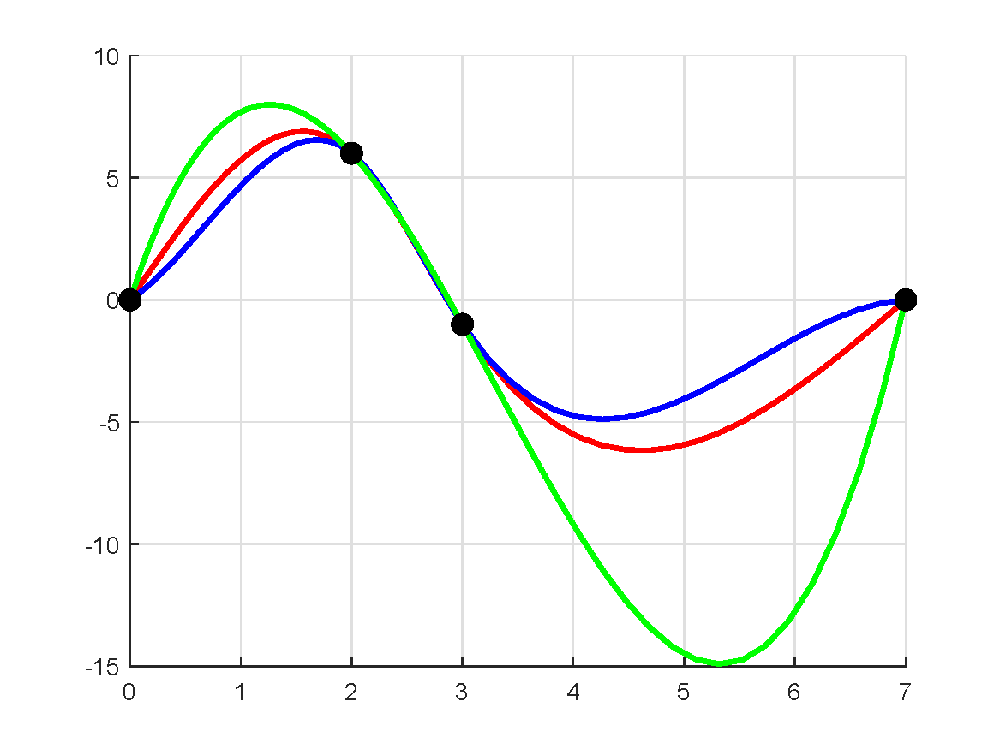

# path planning mathod based on cubic spline
* This project gives an example, which can be modified by users.    
* Every block during option start and option end should be modified by users according to the actual situation, where contains printing options.   
* Need to pre install dependency `Eigen`:    
  `sudo apt-get install libeigen3-dev`      
  `sudo ln -s /usr/include/eigen3/Eigen /usr/include/Eigen`    
* Provide simple parameter type checking function.      
* Control points should be expressed in a matrix `P_`, each column of this matrix represents a control point given by the users and this matrix should contains the start point at the first column and the end point at the last column.     
* The coefficients of each segment of the whole path are loaded in `CS->a`, `CS->b`, `CS->c` and `CS->d` after run the function `CS->CubicSplineRun`, if you want to know the specific form of the equation corresponding to each paragraph, please do not commented macro definition `CUBICSPLINE_TEST_PRINT_EQUATION`.
* Parameters `NATURAL`, `CLAMPED` and `NOT_A_KNOT` means different end condition, could be use as `CS->CubicSplineRun(control_pt, NATURAL)` or `CS->CubicSplineRun(control_pt, CLAMPED)` or `CS->CubicSplineRun(control_pt, NOT_A_KNOT)` in the example in `main.cpp`.     
* The test result is as the follow figures, the red line corresponds to `NATURAL`， the blue line corresponds to `CLAMPED` and the green line corresponds to `NOT_A_KNOT`.     

  

* Reference:    
 [三次样条插值(Cubic Spline Interpolation)及代码实现(C语言)](https://www.cnblogs.com/xpvincent/archive/2013/01/26/2878092.html)      